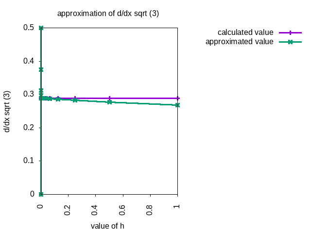
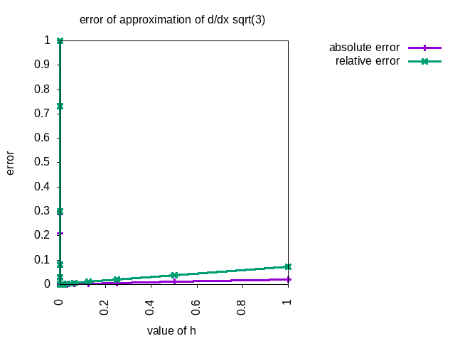
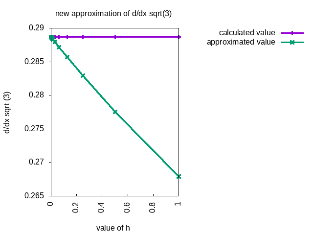
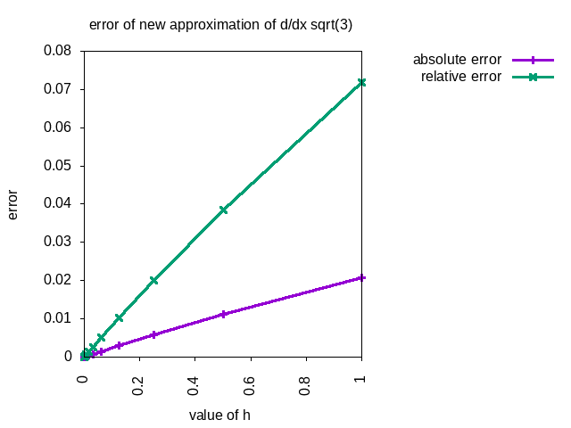

<a href="https://philipnelson5.github.io/math4610/SoftwareManual"> Table of Contents </a>
# Homework 2 Problem 3

**Author:** Philip Nelson

**a.**

\\[\frac{d}{dx}\\]

\\[=\frac{\sqrt(x+h)-\sqrt(x)}{h}\\]

\\[=\frac{\sqrt(x+h)-\sqrt(x)}{h} \cdot \frac{\sqrt(x+h)+\sqrt(x)}{\sqrt(x+h)+\sqrt(x)}\\]

\\[=\frac{x+h-x}{h(\sqrt{x+h}+\sqrt{x})}\\]

\\[=\frac{h}{h(\sqrt{x+h}+\sqrt{x})}\\]

\\[=\frac{1}{\sqrt{x+h}+\sqrt{x}}\\]

**Original Approximation**
\\[\frac{d}{dx} \sqrt{x} = \frac{\sqrt(x+h)-\sqrt(x)}{h}\\]

**New Approximation**
\\[\frac{d}{dx} \sqrt{x} = \frac{1}{\sqrt{x+h}+\sqrt{x}}\\]


<++>


**Last Modified:** <++>September 2018
